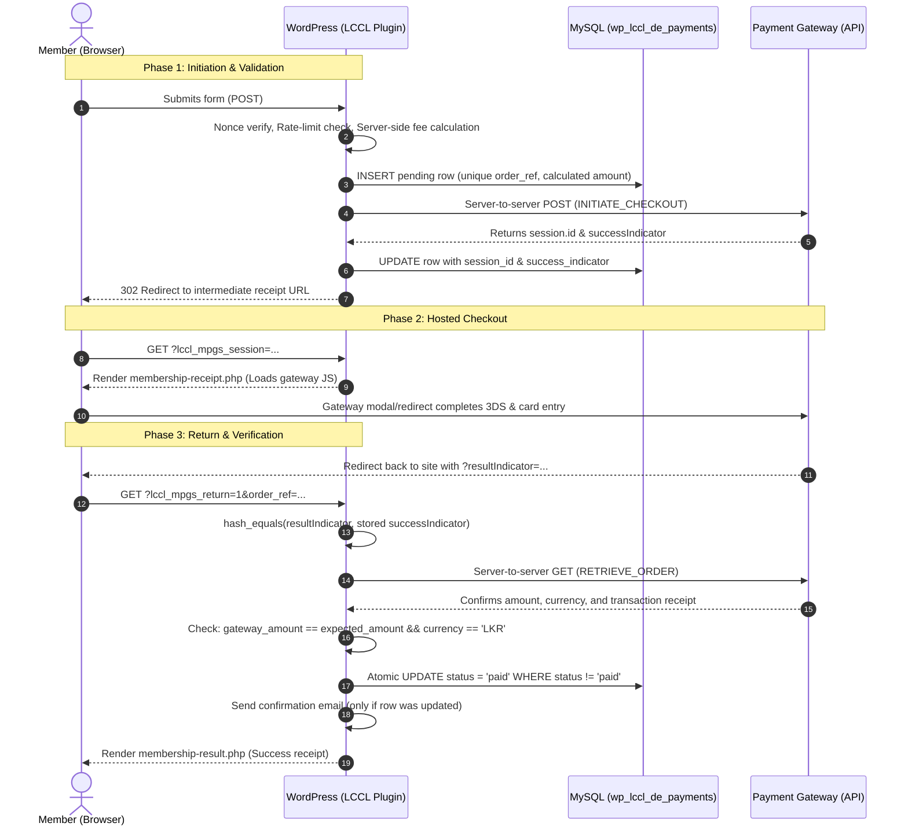

Listed directory includes
Viewed class-lccl-de-mpgs-client.php:1-250
Viewed class-lccl-de-mpgs-client.php:250-361
Viewed class-lccl-de-membership-form.php:60-250
Viewed class-lccl-de-membership-form.php:251-450
Viewed class-lccl-de-membership-form.php:451-650
Viewed class-lccl-de-membership-form.php:651-821
Viewed membership-receipt.php:1-98
Viewed membership-result.php:1-100
Viewed class-lccl-de-settings.php:1-150
Viewed class-lccl-de-settings.php:500-750
Viewed class-lccl-de-settings.php:751-1005
Viewed class-lccl-de-settings.php:250-450
Viewed class-lccl-de-schema.php:1-160
Viewed class-lccl-de-schema.php:250-346

Here is a comprehensive architectural and security study of the payment gateway implementation currently used in the `lccl_membership_fee` form, designed to guide the upcoming migration to the new gateway.

---

### 1. End-to-End Payment Lifecycle & Architecture

The current implementation uses a **Hosted Session / Redirect** architecture across 3 distinct phases, ensuring the merchant server never touches raw card data (full **PCI-DSS SAQ A** compliance):



---

### 2. Key Security Measures in the Current Gateway

#### A. Zero Trust on Client Data & Amounts
* **Server-Authoritative Pricing**: The payment form only sends membership parameters (`membership_type`, `family_count`). The monetary amount is **never** accepted from the browser. It is calculated strictly on the server via [`LCCL_DE_Membership_Form::breakdown()`](file:///m:/Dev/Work/LCCL/wp-content/plugins/lccl-donations-and-events/includes/class-lccl-de-membership-form.php#L719).
* **Double Amount & Currency Reconciliation**: During the callback, after the gateway returns, the code calls the gateway's server API to retrieve the actual billed transaction and verifies:
  ```php
  if ( abs( $gateway_amount - $expected_amount ) > 0.01 || 'LKR' !== $gateway_currency ) {
      // Mark as failed and abort
  }
  ```
  This prevents currency-switching attacks (e.g. paying 100 USD or 100 JPY instead of 100 LKR) and client-side amount tampering.

#### B. Cryptographic Handshake Verification
* **Secret Indicator Matching**: When initiating a session, the gateway returns a cryptographically random `successIndicator`. When the browser redirects back, it carries `resultIndicator`.
* **Timing-Attack Resistance**: The indicators are compared using [`hash_equals()`](file:///m:/Dev/Work/LCCL/wp-content/plugins/lccl-donations-and-events/includes/class-lccl-de-mpgs-client.php#L162), preventing string-comparison timing leaks:
  ```php
  public static function verify_result_indicator( $result_indicator, $success_indicator ) {
      return hash_equals( (string) $success_indicator, (string) $result_indicator );
  }
  ```
* **Server-to-Server Verification**: The code never marks an order paid based purely on query parameters. It always calls `retrieve_order()` server-to-server to inspect the authoritative transaction state.

#### C. Prevention of Double Charges & Race Conditions
* **Atomic Status Transition**:
  ```sql
  UPDATE wp_lccl_de_payments
  SET status = 'paid', gateway_receipt = %s, gateway_response = %s, paid_at = %s
  WHERE order_ref = %s AND status != 'paid'
  ```
* **Single Email Guarantee**: The member confirmation email is only dispatched if `$wpdb->query()` returns `> 0` (meaning this specific request made the transition). If a user refreshes the page or two webhooks/redirects fire simultaneously, the second call is a no-op.
* **Idempotency on Callback**: If the record is already `paid`, the callback handler immediately returns the existing receipt details without re-processing or re-querying the gateway.

#### D. Credential Storage & Encryption at Rest
* **AES-256-GCM Encryption**: Gateway API passwords are encrypted before being written to `wp_options` using [`openssl_encrypt('aes-256-gcm', ...)`] with a 12-byte random IV and a 16-byte authentication tag ([`class-lccl-de-settings.php:290`](file:///m:/Dev/Work/LCCL/wp-content/plugins/lccl-donations-and-events/includes/class-lccl-de-settings.php#L290)).
* **External Key Derivation**: The encryption key is derived via SHA-256 from WordPress salt constants (`wp_salt('auth')` and `wp_salt('secure_auth')`) in `wp-config.php`, so even a full database dump does not expose the plaintext API passwords.
* **HTTPS Protocol Enforcement**: Gateway URLs are strictly validated to require `https://`.

#### E. Anti-Abuse & Rate Limiting
* **IP Rate Limiting**: Max 10 checkout session initiations per IP per 10 minutes using WordPress transients ([`class-lccl-de-membership-form.php:207`](file:///m:/Dev/Work/LCCL/wp-content/plugins/lccl-donations-and-events/includes/class-lccl-de-membership-form.php#L207)).
* **Proxy-Aware Client IP**: Checks `HTTP_X_FORWARDED_FOR` and validates IPs against `FILTER_VALIDATE_IP`.
* **CSRF Protection**: Form submission is protected by `check_admin_referer()` with a dedicated nonce action.

#### F. Information Disclosure Prevention
* Detailed technical error strings from gateway HTTP responses are written only to PHP `error_log` with the order reference.
* The frontend user is shown friendly, sanitized error messages (e.g. *"Unable to connect to the payment gateway"*), preventing leakage of API URLs, merchant IDs, or gateway stack traces.

---

### 3. Database Schema Blueprint (`wp_lccl_de_payments`)

The database table ([`class-lccl-de-schema.php:315`](file:///m:/Dev/Work/LCCL/wp-content/plugins/lccl-donations-and-events/includes/class-lccl-de-schema.php#L315)) maintains a complete audit trail:

| Field | Type | Description |
|---|---|---|
| `order_ref` | `varchar(64) UNIQUE` | Unique order ID (`LCCL-MF-YYYYMMDD-XXXXXXXX`) |
| `member_first_name` | `varchar(100)` | Member first name |
| `member_last_name` | `varchar(100)` | Member last name |
| `member_email` | `varchar(191) INDEX` | Member contact email |
| `member_phone` | `varchar(30)` | Member phone / WhatsApp |
| `membership_type` | `varchar(32)` | `member` or `family` |
| `family_count` | `tinyint(3) unsigned` | Number of family members |
| `amount_lkr` | `decimal(12,2)` | Expected amount in LKR |
| `status` | `varchar(32) INDEX` | `pending` $\rightarrow$ `paid`, `failed`, `cancelled` |
| `session_id` | `varchar(128)` | Gateway session ID |
| `success_indicator`| `varchar(64)` | Secret indicator / token from session |
| `gateway_receipt` | `varchar(128)` | Authoritative receipt/transaction number |
| `gateway_response` | `longtext` | Full JSON response payload from the gateway |
| `ip_address` | `varchar(45)` | Client IP address at submission |
| `created_at` | `datetime INDEX` | Timestamp when order was created |
| `paid_at` | `datetime` | Timestamp when payment was verified |

---

### 4. Checklist for Migrating to the New Gateway

When implementing the new payment gateway, we should preserve and enhance this foundation:

1. **Gateway Client Abstraction**:
   - Create a clean client class (e.g., `LCCL_DE_NewGateway_Client`) with static or injected methods: `initiate_checkout()`, `verify_payment()`, `get_config()`.
2. **Support Asynchronous Webhooks / IPN**:
   - In addition to browser redirects (which can fail if the user closes their tab before redirecting back), implement a dedicated REST or admin-ajax webhook endpoint (e.g. `wp-json/lccl/v1/payment-webhook`) to receive asynchronous server notifications from the new gateway.
   - Verify webhook signatures (HMAC-SHA256) before processing.
3. **Multi-Merchant Profile Support**:
   - Integrate with [`LCCL_DE_Settings`](file:///m:/Dev/Work/LCCL/wp-content/plugins/lccl-donations-and-events/includes/class-lccl-de-settings.php) multi-profile system (`membership`, `donations`, `project_1`, `project_2`) so each payment stream can independently point to its own merchant ID or sub-account.
4. **Preserve AES-256-GCM Credential Encryption**:
   - Ensure the new gateway's secret keys / tokens are stored using the existing `encrypt_secret()` / `decrypt_secret()` helpers.
5. **Idempotent Webhook & Callback Handling**:
   - Use the same atomic SQL `WHERE status != 'paid'` guard to ensure webhooks and return URLs never trigger duplicate emails, receipts, or state corruptions.

Whenever you are ready to start integrating the new gateway, share the gateway name, documentation, or API specs and we will begin building it.